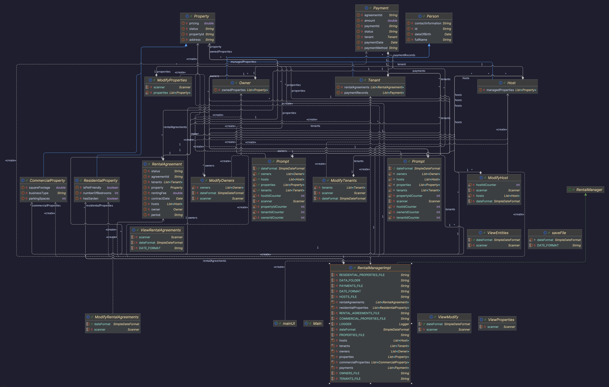

# FurtherProgramming-Ass1

This project is an assignment for the Further Programming course. It involves implementing a rental management system.

## Table of Contents

- [Installation](#installation)
- [Usage](#usage)
- [Features](#features)
- [Contributing](#contributing)
- [License](#license)

## Installation

To install this project, clone the repository and build it using a Java build tool like Maven or Gradle.

```shell
git clone https://github.com/TrnLin/FurtherProgramming-Ass1.git
cd FurtherProgramming-Ass1
./mvnw install
```

## Sample data is as follow

### Person, Owner, Host, Tenants

| Id  | Full Name     | DoB        | Contact Information |
| --- | ------------- | ---------- | ------------------- |
| 1   | Michael Brown | 07/23/1965 | michael@example.com |

### Porperty

| Id   | Address       | Price     | Status |
| ---- | ------------- | --------- | ------ |
| P001 | 123 Cherry St | 200000.00 | Sold   |

### Residental Porperty

| Id   | Address     | Price       | Status    | Number of Bedroom | Has Garden | Pet  |
| ---- | ----------- | ----------- | --------- | ----------------- | ---------- | ---- |
| R001 | 123 Main St | 2000.000000 | Available | 3                 | true       | true |

### Commercial Porperty

| Id   | Address       | Price       | Status | Bussiness Type | Parking Space | Square Footage |
| ---- | ------------- | ----------- | ------ | -------------- | ------------- | -------------- |
| C001 | 101 Market Rd | 3000.000000 | Rented | Retail         | 10            | 2500.500000    |

### Payment

| Id           | AgreementId    | Tenant   | Ammount     | Payment Date | Payment Method | Status    |
| ------------ | -------------- | -------- | ----------- | ------------ | -------------- | --------- |
| PaymentId123 | AgreementId456 | John Doe | 1500.000000 | 2023-10-14   | Credit Card    | Completed |

### Rental Agreement

| Id  | Tenant               | Host        | Owner         | Property    | Contact Date | Period  | Renting Fee | Status |
| --- | -------------------- | ----------- | ------------- | ----------- | ------------ | ------- | ----------- | ------ |
| 1   | John Doe, Jane Smith | Emily Davis | Michael Brown | 123 Main St | 2023-01-01   | Monthly | 1500.000000 | Active |

## Features

- Manage rental agreements
- Add, update, delete tenants, hosts, and owners
- Handle residential and commercial properties

## UML Diagram



## Contributing

Contributions are welcome! Please fork the repository and submit a pull request.

License
This project is licensed under the MIT License.
